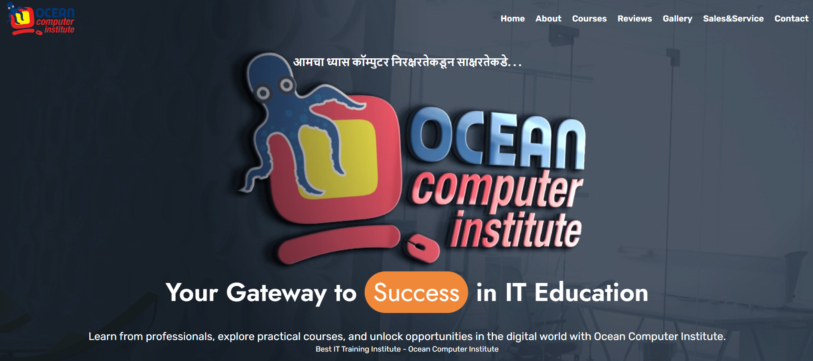
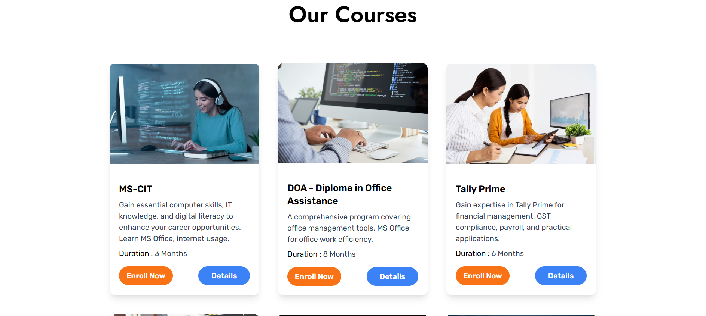

# 🌊 Ocean Computer Institute – Official Website

This is the official website for **Ocean Computer Institute**, located in Ichalkaranji. It showcases the institute’s course offerings, vision, contact details, and more to help students and visitors learn about and engage with the institute.

🔗 **Live Site**: [https://oceancomputerinstitute.in](https://oceancomputerinstitute.in)

---

## 🛠️ Tech Stack

- **HTML5** – Semantic structure and accessible layout
- **Tailwind CSS** – Modern utility-first styling for responsiveness
- **JavaScript** – For interactivity and dynamic components
- **SEO Meta Tags** – For search engine visibility and social media sharing

---

## 📋 Features

- 📚 Courses section with descriptions (MS Office, Tally, DOA, Programming, etc.)
- 📞 Contact section with location and WhatsApp integration
- 🖼️ Hero banner and visuals to highlight the institute
- 📱 Fully responsive design (mobile-first)
- 🔍 Basic SEO for better search engine ranking
- ⚡ Fast-loading and lightweight static site

---

## 🔍 SEO Optimization

The website includes essential meta tags for SEO such as:

- Page `<title>` and `<meta description>`
- `<meta name="keywords">` for course-related search terms
- Open Graph (`og:`) tags for social media previews
- Favicon and responsive meta tags
- `robots` tag set to `index, follow` for search engine crawling

✅ SEO helps the institute appear on Google when users search for terms like:
- *Computer Institute in Ichalkaranji*
- *Tally or DOA courses ichalkaranji*
- *Best MS Office training in Kolhapur region*, etc.

---

---

## 📸 Screenshots

  
  
  
  

---

## 🙋‍♂️ Developer

Developed by **Vivek Rokadi** and **Preetam Patil** – Web developers and founders of [Nova Next](#), specializing in responsive business websites and SEO-optimized solutions.

---

⭐ Star this project if you like it
